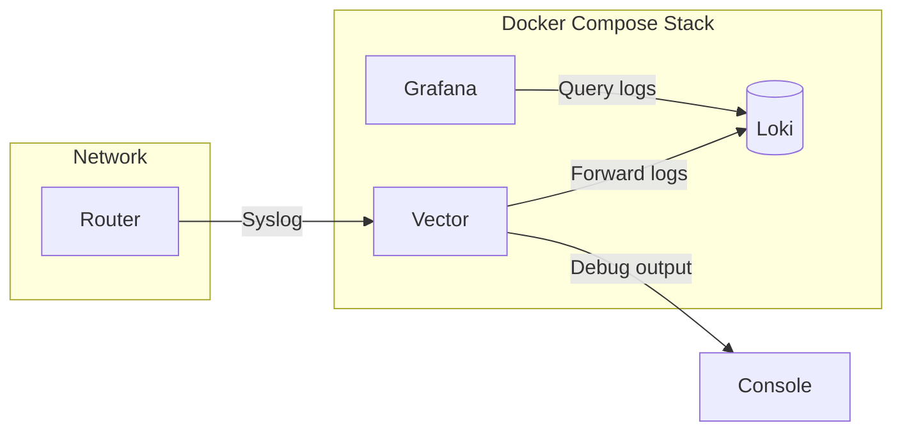

# Syslogger

This is a Docker Compose setup that receives syslog messages via Vector, stores them in Loki, and runs Grafana for visualization.

## Notable Files

- `compose.yaml` - Orchestrates Vector, Loki, and Grafana
- `vector/vector.yaml` - Vector configuration for syslog input and Loki output
- `grafana/datasources.yaml` - Auto-configures Loki as a Grafana datasource
- `grafana/dashboard.json` - A JSON export of a dashboard that visualizes logs

## Quick Start

1. Start the stack:
   ```bash
   docker compose up -d
   ```

2. Verify services are running:
   ```bash
   docker compose ps
   ```

3. Set up syslog traffic

4. Access Grafana
   - URL: http://localhost:3000
     - Username: `admin`
     - Password: `admin`
     - _You'll be prompted to change the password on first login_
   - Import the dashboard from JSON

## Architecture



- **Vector** receives syslog messages, parses them, and forwards to both console and Loki
- **Loki** stores the logs with labels for efficient querying
- **Grafana** provides a web UI to explore and visualize the logs

## Useful Commands

View Vector/Loki logs:

```bash
docker compose logs -f vector
docker compose logs -f loki
```

Check if Loki is receiving messages:

```bash
curl http://localhost:3100/ready
curl -s "http://localhost:3100/loki/api/v1/labels" | jq
```

Query Loki directly:

```bash
curl -G -s "http://localhost:3100/loki/api/v1/query_range" \
  --data-urlencode 'query={job="syslog"}' \
  --data-urlencode "limit=10" | jq
```

Stop the stack:

```bash
docker compose down
docker compose down -v # To remove volumes (deletes all data)
```

## Raspberry Pi

To run Docker on a Raspberry Pi, follow the [Debian installation instructions](https://docs.docker.com/engine/install/debian/).

All previous instructions also apply to running the services on a Raspberry Pi.
